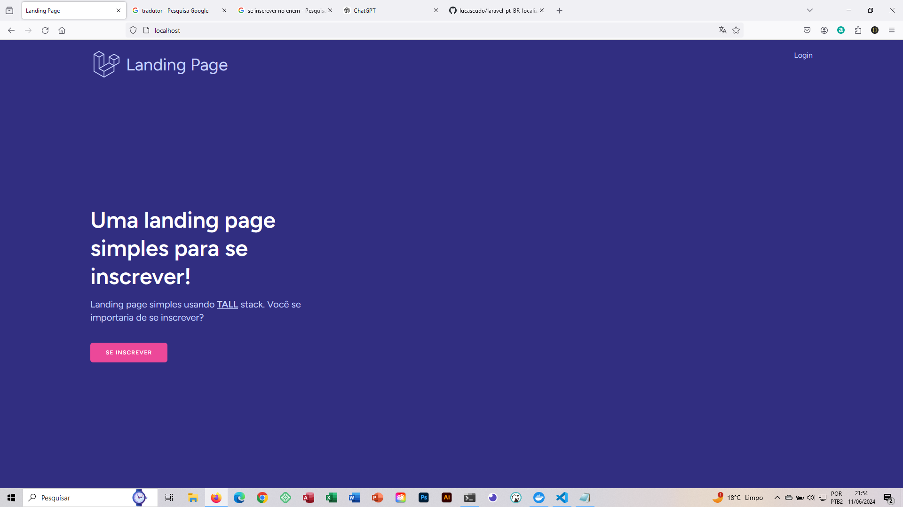
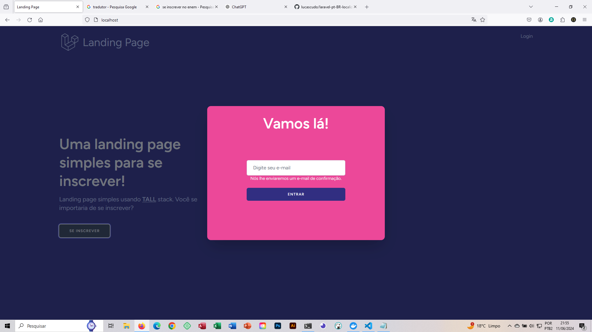
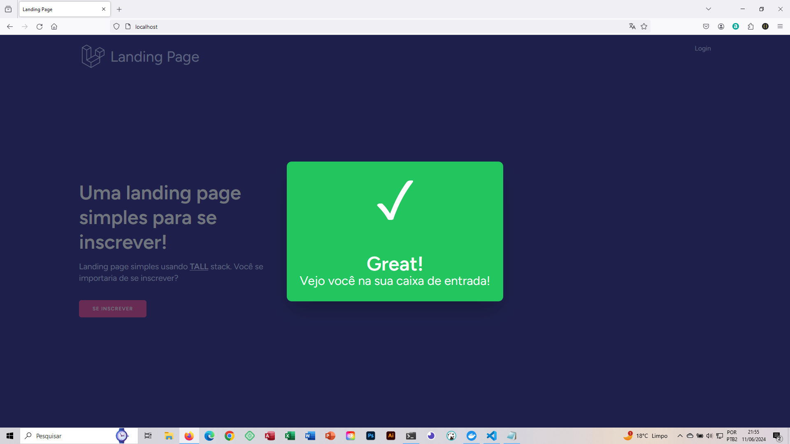
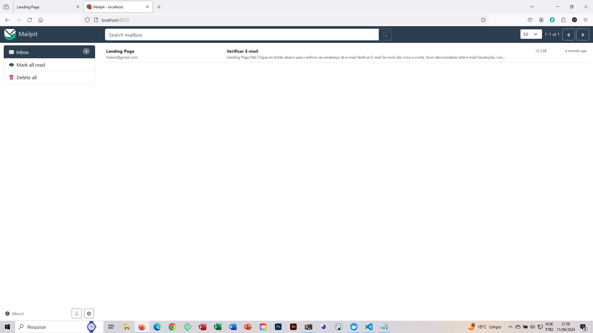
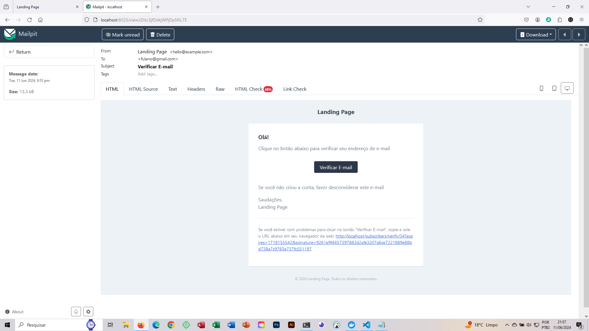
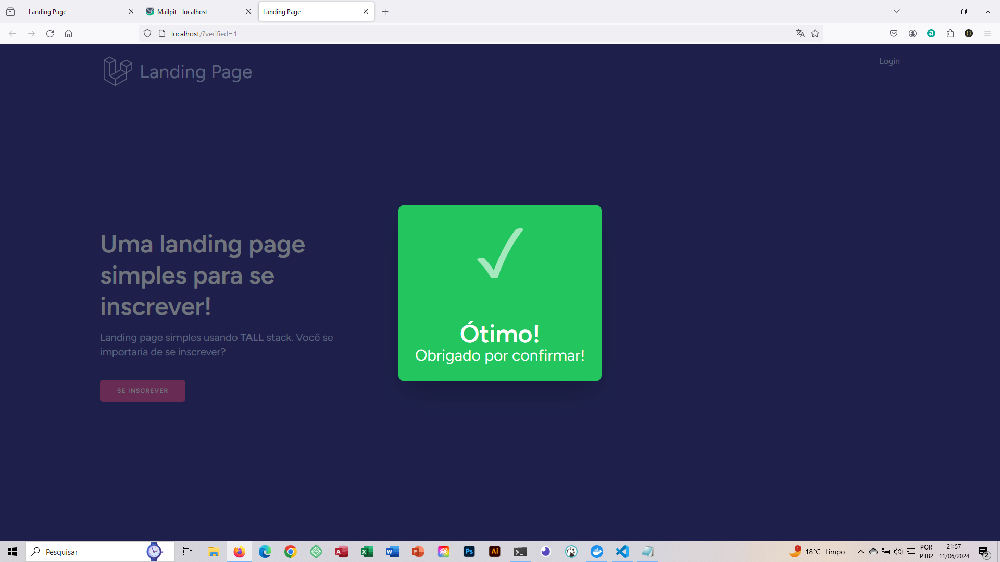
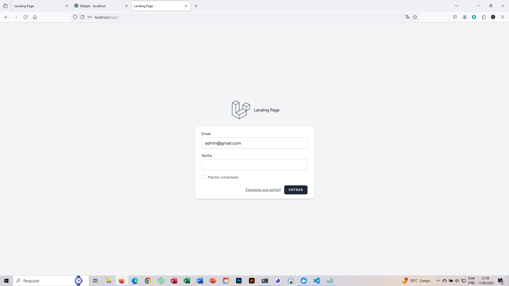
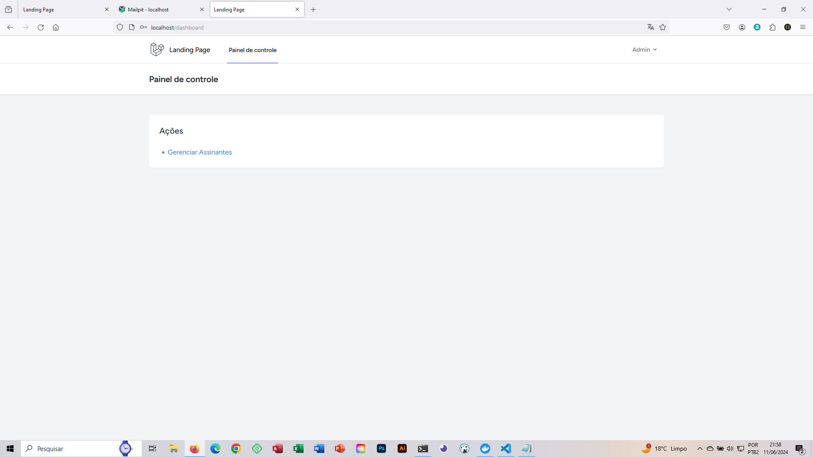
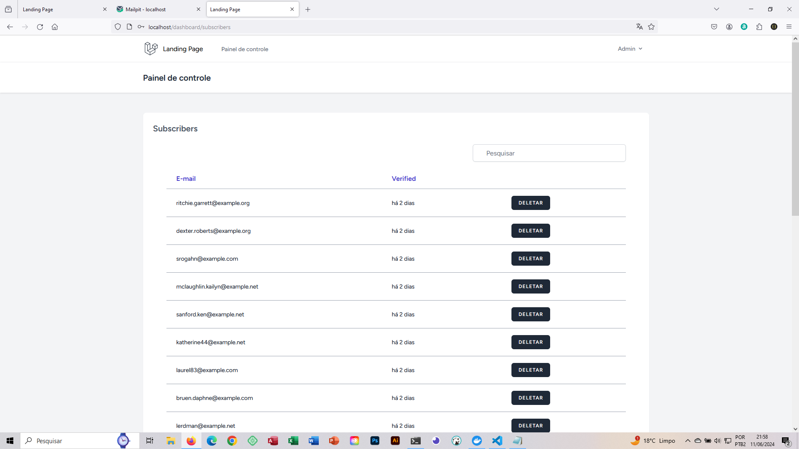

# Projeto Landing Page

Este é um projeto de uma landing page simples com um sistema de inscrição e gerenciamento de inscritos. O projeto foi desenvolvido utilizando Tailwind CSS, Alpine.js, Laravel e Livewire. Para o ambiente de desenvolvimento, foram utilizados Laravel Sail e Mailpit.

## Créditos

Este projeto foi desenvolvido com base no conhecimento adquirido no curso "Start with TALL: Use Tailwind, Alpine, Laravel and Livewire" da plataforma Udemy, ministrado por [JuanD MeGon](https://www.udemy.com/course/tall-stack-integrate-tailwind-alpine-laravel-and-livewire).


## Tecnologias Utilizadas

- **Tailwind CSS**: Para estilização da página.
- **Alpine.js**: Para manipulação de estados e interações no front-end.
- **Laravel**: Framework PHP utilizado para o desenvolvimento do back-end.
- **Livewire**: Para componentes interativos sem sair do Laravel.
- **Laravel Sail**: Ambiente de desenvolvimento em Docker.
- **Mailpit**: Para teste de envio de emails durante o desenvolvimento.

## Durante o curso, aprendi a:

- Utilizar Tailwind CSS para estilização rápida e responsiva.

- Implementar interatividade dinâmica com Alpine.js.

- Desenvolver aplicações robustas com o framework PHP Laravel.

- Criar componentes dinâmicos e reativos com Livewire.

## Funcionalidades do app

- **Inscrição por Email**: Usuários podem se inscrever na landing page utilizando seu email.
- **Gerenciamento de Inscritos**: Interface administrativa para listar, pesquisar e deletar inscritos.

## Instalação

### Pré-requisitos

- Docker e Docker Compose instalados na sua máquina.

### Passos

1. Clone o repositório:

    ```bash
    git clone https://github.com/diego-ronan-felix/landing-page.git
    cd landing-page
    ```

2. Copie o arquivo `.env.example` para `.env` e configure as variáveis de ambiente conforme necessário:

    ```bash
    cp .env.example .env
    ```

4. Abra o arquivo .env em um editor de texto e configure as variáveis de ambiente conforme mostrado abaixo:

   ```bash
    DB_CONNECTION=mysql
    DB_HOST=mysql
    DB_PORT=3306
    DB_DATABASE=laravel
    DB_USERNAME=sail
    DB_PASSWORD=password
    ```
   
3. Instale as dependências do projeto:

    ```bash
    docker run --rm \
    -u "$(id -u):$(id -g)" \
    -v "$(pwd):/var/www/html" \
    -w /var/www/html \
    laravelsail/php83-composer:latest \
    composer install --ignore-platform-reqs
    ```
        
6. Suba os containers do Laravel Sail:

    ```bash
    ./vendor/bin/sail up -d
    ```

7. Gere a chave da aplicação:

    ```bash
    ./vendor/bin/sail artisan key:generate
    ```

8. Execute as migrações do banco de dados:

    ```bash
    ./vendor/bin/sail artisan migrate
    ```
    
9. Instale as dependências listadas no package.json:

    ```bash
    ./vendor/bin/sail npm install
    ```

10. Execute esse comando para iniciar o Vite

    ```bash
    ./vendor/bin/sail npm run dev
    ```

# Screenshoots



















